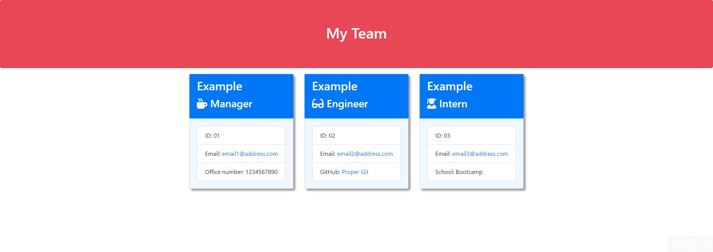
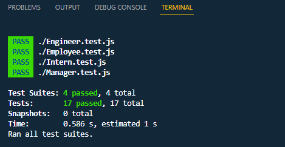

# Team Profile Generator
  
  

  ## Description
  A user can generate a webpage that displays their team's basic info so that they have quick access to their teams emails and GitHub profiles. 

  *Screenshot of the team.html output after inputting some examples*
  
 ## Table of Contents
 * [Installation](#installation) 
 * [Usage](#usage) 
 * [Tests](#tests) 
 * [Contributing](#contributing) 
 * [Questions](#questions) 
 * [Deployed Site URL](#deployed-site-url) 
 * [License](#license) 

  ## Installation
  Copy the repo using 'git pull, then open the repo in your chosen IDE and run node.js (install node.js if not installed). Install all dependancies using 'npm i', which will install all dependancies as detailed in the package.json file. Then open the index.js in the integrated Terminal and use command 'node index' to start the prompts that will generate the team.html after answering the prompts.
  ## Usage
  When prompted enter the requested information for the Team Manager and press Enter, then choose whether to add an Engineer or an Intern (follow the prompts). After enterning an Engineer or Intern you will be prompted again to add an Engineer or Intern. Complete this cycle as many times as required. When complete select "Finish Building Team" and the Team.html will be generated which will contain all the Employees entered.
  ## Tests
  Delightful JavaScript Testing using [JEST](https://www.npmjs.com/package/jest)  

  

  Open the "__tests__" folder which contains tests for each class of Employee. To test a specific class, open the respective .js file within the terminal and run the command "npm run test". The results of the test will be logged in the terminal. 

  *Screenshot of the test results in vs code terminal*
  

## Built With

Team Profile Generator was built using;

  ## Contributing
  - Sam Brooke - [Sam010000101](https://github.com/Sam010000101) 
  - Tobias Firth - [tobias-firth](https://github.com/tobias-firth) 
  - Adam W - [ad0m](https://github.com/ad0m) 
  - Damien N.Ayine - [Damiennsoh](https://github.com/Damiennsoh) 
  ## Questions
  You can direct any questions that you may have regarding this project to; 

  - GitHub: [Sam010000101](https://github.com/Sam010000101)
  - Email: reposme@outlook.com
  ## Deployed Site URL
  https://github.com/Sam010000101/team-profile-generator
  ## License
  This project is covered by the MIT license.

  Copyright (c) 2023 Sam Brooke

  Permission is hereby granted, free of charge, to any person obtaining a copy of this software and associated documentation files (the "Software"), to deal in the Software without restriction, including without limitation the rights to use, copy, modify, merge, publish, distribute, sublicense, and/or sell copies of the Software, and to permit persons to whom the Software is furnished to do so, subject to the following conditions:

  The above copyright notice and this permission notice shall be included in all copies or substantial portions of the Software.

  THE SOFTWARE IS PROVIDED "AS IS", WITHOUT WARRANTY OF ANY KIND, EXPRESS OR IMPLIED, INCLUDING BUT NOT LIMITED TO THE WARRANTIES OF MERCHANTABILITY, FITNESS FOR A PARTICULAR PURPOSE AND NONINFRINGEMENT. IN NO EVENT SHALL THE AUTHORS OR COPYRIGHT HOLDERS BE LIABLE FOR ANY CLAIM, DAMAGES OR OTHER LIABILITY, WHETHER IN AN ACTION OF CONTRACT, TORT OR OTHERWISE, ARISING FROM, OUT OF OR IN CONNECTION WITH THE SOFTWARE OR THE USE OR OTHER DEALINGS IN THE SOFTWARE.

